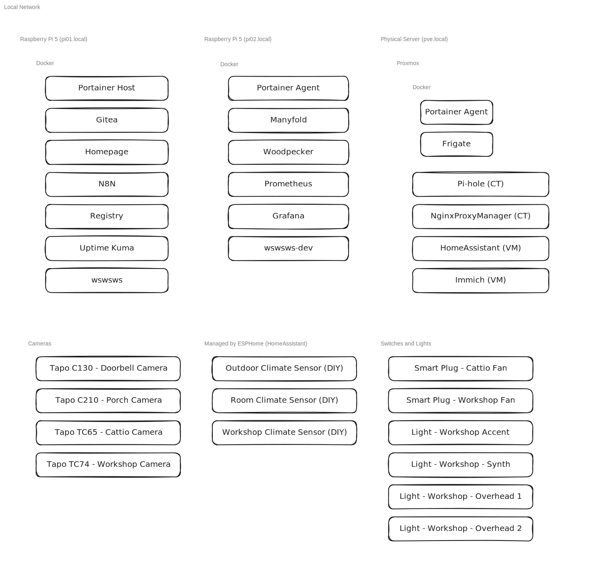

# Homelab
[![CC BY-SA 4.0][cc-by-sa-shield]][cc-by-sa]

## Philosophy
This homelab is my place to self-host stuff and learn how it all works.
I keep it around to make my day-to-day easier, while still getting to tinker
and understand the systems I run.

## Docs
- [Ansible](ansible/README.md)
- [Architecture](#architecture)
- [Network](docs/network.md)

## Architecture Overview
My homelab runs on a mix of Raspberry Pis and servers built out of old PC hardware. I manage my containers using Portainer and Proxmox VE (PVE), letting me easily organize and run services across all devices.

Here's is a high-level overview of the setup:

## Services
### Docker
- [Frigate](docker/frigate/README.md) - Security camera feed processing, archiving, and object identification.
- [Gitea](docker/gitea/README.md) - Git hosting service
- [Grafana](docker/grafana/README.md) - Observability platform for visualizing machine analytics. I use it to monitor my servers.
- [Homepage](docker/homepage/README.md) - Application dashboard for all of my homelab services.
- [Manyfold](docker/manyfold/README.md) - 3D-model inventory management. This is where I keep all the models (both 3rd-party and original) that I've printed previously and that I might want to print again in the future.
- [N8N](docker/n8n/README.md) - Workflow automation.
- [Prometheus](docker/grafana/README.md) - Event monitoring and alerting software with timeseries database. I use it to store machine stats to be used by [Grafana](docker/grafana/README.md).
- [Registry](docker/registry/README.md) - Local Docker container registry.
- [Uptime Kuma](docker/uptime-kuma/README.md) - Uptime monitoring.
- Wswsws - Cat shelter management software. This is a personal project that I will be releasing as open-source in the future.
- [Woodpecker](docker/woodpecker/README) - CI/CD engine.

### Proxmox
- Containers
    - NGINX Proxy Manager - Reverse proxy for internal services. This allows me to route `*.benjiao.net` requests to the correct services.
    - Pi-hole - DNS and Ad-blocking service.
- VMs
    - HomeAssistant - Home automation platform.
    - Immich - Photo and video management.

Camera feeds are being processed by [Frigate](docker/frigate/README.md). Climate sensors are being ingested by HomeAssistant. Smart Plugs and Lights are being controlled by HomeAssistant.

## License
This work is licensed under a
[Creative Commons Attribution-ShareAlike 4.0 International License][cc-by-sa].

[![CC BY-SA 4.0][cc-by-sa-image]][cc-by-sa]

[cc-by-sa]: http://creativecommons.org/licenses/by-sa/4.0/
[cc-by-sa-image]: https://licensebuttons.net/l/by-sa/4.0/88x31.png
[cc-by-sa-shield]: https://img.shields.io/badge/License-CC%20BY--SA%204.0-lightgrey.svg
