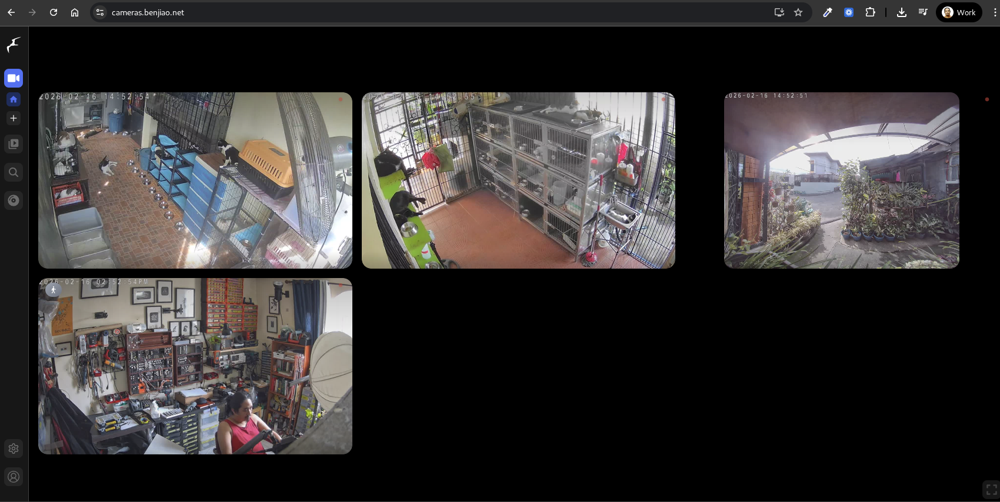

# Frigate
Live processing of our security camera feeds.

## Setup Notes
- Configuration of the cameras can be done through the web interface (`/config`). Copy `config.yml` and replace the username and password for each camera. All of our cameras are TP-Link Tapo, so setting of the passwords can be done through the TP-Link app.