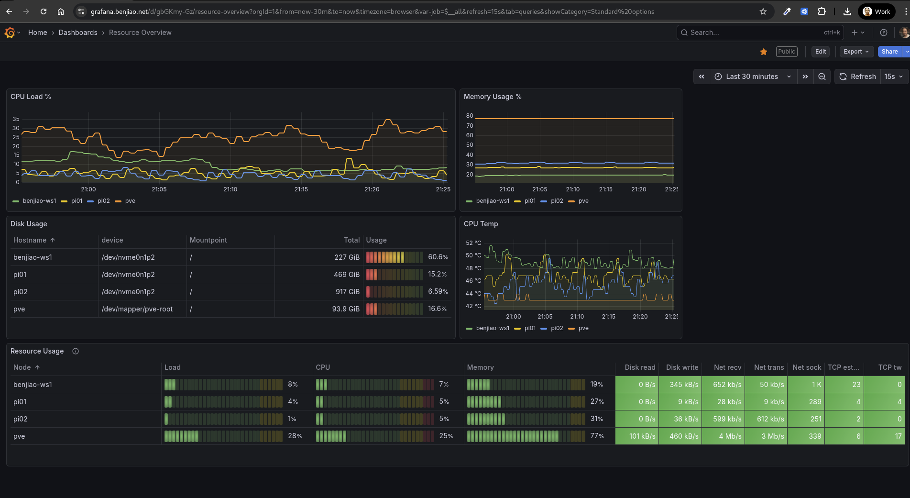

# Grafana and Prometheus
A Grafana + Prometheus stack that I use for monitoring machines in my homelab.

## References
- Grafana: https://grafana.com/docs/grafana/latest/setup-grafana/installation/docker/
- Prometheus and Node Exporter: https://grafana.com/docs/grafana-cloud/send-data/metrics/metrics-prometheus/prometheus-config-examples/docker-compose-linux/
